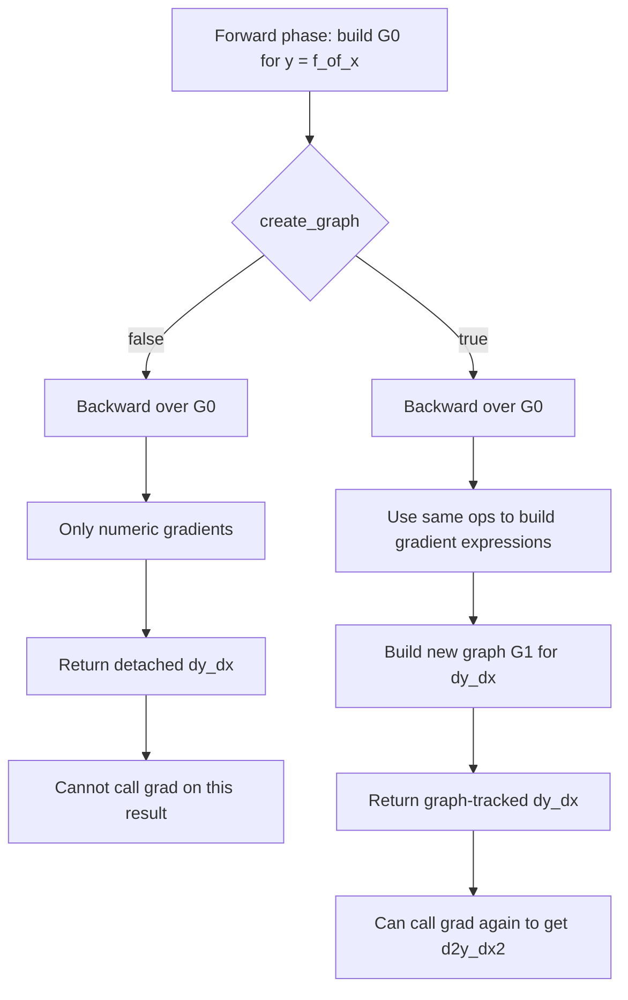
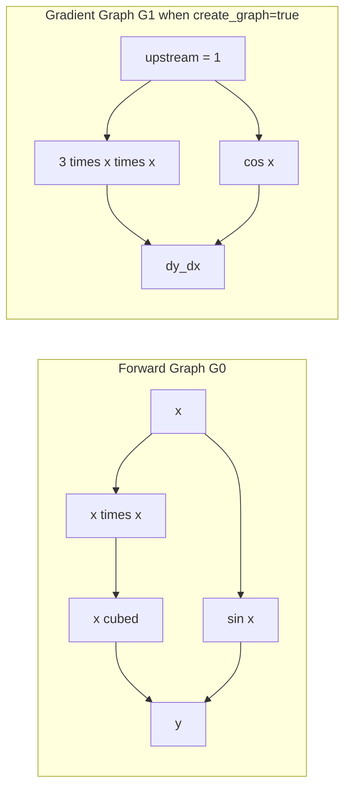

# C/C++ 模拟 PyTorch 自动微分与嵌套计算图技术报告

## 1. 目标与交付

目标是给出一套最小可运行的 C++ 自动微分实现，用来模拟 PyTorch 的两种关键能力：

- 动态计算图 + 一次反向传播求一阶导
- `create_graph=true` 风格的嵌套计算图，从而继续求二阶导

本次交付包含：

- 示例源码：`examples/autodiff/nested_graph.cpp`
- 可执行目标：`example_autodiff_nested_graph`
- 实测输出：一阶导、二阶导与解析解一致

---

## 2. 总体设计

### 2.1 数据结构

实现核心是 `Node`：

- `value`：当前节点前向值
- `requires_grad`：是否需要梯度
- `parents`：本节点依赖的父节点
- `vjp`：反向向量-雅可比积函数，输入是上游梯度，输出是每个父节点的梯度

这种设计等价于将每个算子都写成：

1. 前向计算输出值
2. 注册一个本地反向规则（链式法则局部项）

### 2.2 算子接口

示例实现了：

- 基础算子：`add`、`mul`、`neg`、`sub`
- 常见非线性：`sin`、`cos`、`tanh`

例如乘法局部导数：

- 对第一个输入：$\partial (ab)/\partial a = b$
- 对第二个输入：$\partial (ab)/\partial b = a$

在 `vjp` 里就写成：

- `dL/da = upstream * b`
- `dL/db = upstream * a`

---

## 3. 反向引擎（一阶导）

### 3.1 拓扑逆序

`grad(output, input, create_graph)` 的流程：

1. 从 `output` 做 DFS，得到拓扑序
2. 初始化种子梯度 `doutput/doutput = 1`
3. 按逆拓扑遍历节点，调用各节点 `vjp` 把梯度分发给父节点
4. 对同一父节点来自多条路径的梯度做累加

对应公式：

$$
\frac{\partial L}{\partial x_i} = \sum_j \frac{\partial L}{\partial y_j}\frac{\partial y_j}{\partial x_i}
$$

### 3.2 为什么可模拟 torch.autograd

因为 PyTorch 的核心也是“动态图 + 局部反向规则 + 逆拓扑传播”。

本实现是最小版本，但机制相同。

---

## 4. 嵌套计算图（高阶导）

### 4.1 `create_graph=false`

- 反向过程只保留数值梯度
- 梯度结果不再可导

### 4.2 `create_graph=true`

- 反向过程中的梯度表达式继续用同一套算子构建
- 因而会形成一张新的“梯度图”
- 这张图可以继续调用 `grad`，得到二阶导

这对应 PyTorch 里：

- `torch.autograd.grad(..., create_graph=True)`

### 4.3 示例函数

演示函数是：

$$
y = x^3 + \sin(x)
$$

解析解：

$$
\frac{dy}{dx} = 3x^2 + \cos(x),\qquad
\frac{d^2y}{dx^2} = 6x - \sin(x)
$$

程序流程：

1. `dy_dx_plain = grad(y, x, false)`
2. `dy_dx_graph = grad(y, x, true)`
3. `d2y_dx2 = grad(dy_dx_graph, x, false)`

### 4.4 两种模式执行流对照图





### 4.5 详细机制解释（为什么 false 不可再导，true 可以）

把反向阶段看成“计算梯度表达式”的过程：

1. 两种模式都会先逆拓扑遍历前向图 `G0`。
2. 区别在于每一步本地导数如何表示。

`create_graph=false`：

- 本地导数项会立刻化为数值（常量节点语义）。
- 梯度累加也是纯数值相加。
- 返回的 `dy/dx` 只保存值，不保存“它怎么被算出来”。
- 因此后续再调用 `grad(dy_dx, x, ...)` 时，没有可继续传播的梯度路径。

`create_graph=true`：

- 本地导数项继续使用同一套算子（`add/mul/sin/cos/...`）构建。
- 梯度累加过程本身也成为图中的算子节点。
- 返回的 `dy/dx` 既有数值，也带有“梯度计算来源”的图结构 `G1`。
- 对 `dy_dx` 再调用一次 `grad`，就等价于在 `G1` 上做反向，得到二阶导。

这正是“嵌套计算图”的本质：

- 第一层图 `G0` 负责前向值 `y`
- 第二层图 `G1` 负责一阶导 `dy/dx`
- 在 `G1` 上继续反向得到 `d2y/dx2`

### 4.6 与 PyTorch 的一一对应

在 PyTorch 中，同样的语义通常写成：

```python
dy_dx = torch.autograd.grad(y, x, create_graph=True)[0]
d2y_dx2 = torch.autograd.grad(dy_dx, x, create_graph=False)[0]
```

对照关系：

- `create_graph=False`：更像“只要梯度值”（近似 detached 语义）
- `create_graph=True`：需要“梯度值 + 梯度图”，用于高阶导

---

## 5. 关键代码解释

### 5.1 `Node` 的 `vjp` 回调

`vjp` 是整个自动微分的关键抽象：

- 输入：上游梯度 `upstream`
- 输出：对每个父节点的梯度向量

这样每个算子只需关注本地导数，不需要知道整图结构。

### 5.2 `grad(...)` 的梯度累加

同一节点可能被多条路径依赖，因此梯度必须累加而不是覆盖。

在 `create_graph=true` 下，累加也通过 `add` 算子完成，因此累加本身也可继续求导。

### 5.3 为什么一阶图节点更多

前向图只包含前向算子。

开启 `create_graph=true` 后，反向里出现的新算子（如乘法、加法、三角函数导数相关算子）也会成为节点，因此图会显著变大。

---

## 6. 构建与运行

构建目标：

```bash
/Users/hhd/miniforge3/envs/py310/bin/cmake -S /Users/hhd/Desktop/test/c-pinn -B /Users/hhd/Desktop/test/c-pinn/build -DPINN_USE_TORCH=OFF -DCMAKE_BUILD_TYPE=Release
make -C /Users/hhd/Desktop/test/c-pinn/build -j"$(sysctl -n hw.ncpu)" example_autodiff_nested_graph
```

运行：

```bash
/Users/hhd/Desktop/test/c-pinn/build/examples/example_autodiff_nested_graph
```

---

## 7. 实测结果

输入：`x = 0.5`

程序输出核心结果：

- `dy/dx (detached) = 1.627582561890`
- `expected dy/dx   = 1.627582561890`
- 绝对误差：`0`

- `d2y/dx2          = 2.520574461396`
- `expected d2y/dx2 = 2.520574461396`
- 绝对误差：`0`

图规模：

- 前向图 `G0`：`nodes=5`, `edges=7`
- 一阶梯度图 `G1`（`create_graph=true`）：`nodes=12`, `edges=19`

这说明嵌套图已经成功建立，并可用于二阶导。

---

## 8. 与当前 PINN 项目的关系

你当前 pure C++ PINN 采用 stencil + 手动链式法则，尚非通用动态图自动微分。

本示例可作为“最小原型层”来验证以下迁移方向：

- 将残差表达式改为图算子表达
- 用 `grad(..., create_graph=true)` 求 PDE 的高阶导
- 从“每个 stencil 点手动 forward/backward”转向“图反传一次得到参数梯度”

这正是模拟 PyTorch 自动微分与嵌套图的核心路径。

---

## 9. 已修改文件

- `examples/autodiff/nested_graph.cpp`
- `examples/autodiff/matrix_graph.cpp`
- `examples/CMakeLists.txt`
- `docs/autodiff/nested_graph_tech_report.md`
- `benchmark/autodiff/test_nested_graph.py`
- `benchmark/autodiff/test_matrix_graph.py`
- `benchmark/autodiff/results/nested_graph_test_results.json`
- `benchmark/autodiff/results/nested_graph_test_report.md`
- `benchmark/autodiff/results/matrix_graph_test_results.json`
- `benchmark/autodiff/results/matrix_graph_test_report.md`

---

## 10. 矩阵版 AD 扩展（含 matmul）

为更接近真实 PINN 训练，本项目新增了矩阵形态前向路径（依然由标量节点构图）：

- `VarMatrix`：二维容器，元素类型为 `NodePtr`
- `matmul`：矩阵乘法由标量 `mul + add` 组合
- `mat_add_rowwise`：按行加偏置
- `mat_tanh`：激活函数逐元素作用

最小网络 `TinyFNN` 结构为 `[2,4,1]`，前向流程为：

1. `a = [x, t]`
2. `z = matmul(a, W0) + b0`
3. `a = tanh(z)`
4. `u = matmul(a, W1) + b1`

虽然该实现尚未做张量级优化，但已完整覆盖：

- 参数节点构图
- PDE 残差上的嵌套 `grad`
- 参数梯度回传与更新

---

## 11. 3 方程残差与训练流程（矩阵 AD 原型）

矩阵原型复用了标量 AD 内核，构建三个方程残差：

- KdV：$u_t + 6uu_x + u_{xxx}$
- Sine-Gordon：$u_{tt} - u_{xx} + \sin(u)$
- Allen-Cahn：$u_t - 10^{-4}u_{xx} + 5(u^3-u)$

每轮训练流程：

1. 固定采样点集合（便于可重复调试）
2. 计算残差 MSE（`create_graph=true`）
3. 对每个参数执行 `grad(loss, p, false)`
4. 梯度裁剪后更新参数
5. 重新评估 loss 记录 best/final

这使得“图正确性验证”与“可复现实验”优先于速度。

---

## 12. 严苛压力测试（多 seed）

### 12.1 测试配置

- seeds：`[7,17,27,37,47]`
- stress iters：`80`
- stress samples：`16`
- 学习率：`5e-4`
- 梯度裁剪：`50`
- 通过标准：`pass_rate >= 0.80` 且 `nan_grad_total = 0`

### 12.2 汇总结果

- Allen-Cahn：`pass_rate=1.00`，`ratio_mean=0.313493`，`worst_ratio=0.494531`，`nan_total=0`
- KdV：`pass_rate=0.80`，`ratio_mean=0.758388`，`worst_ratio=1.022098`，`nan_total=0`
- Sine-Gordon：`pass_rate=0.80`，`ratio_mean=0.875937`，`worst_ratio=1.067619`，`nan_total=0`

结论：

- 三方程在多 seed 下均未出现 NaN 梯度。
- KdV 与 Sine-Gordon 各有 1 个 seed 出现轻微反弹（`ratio` 略高于 1）。
- 在 `pass_rate>=0.8` 标准下，整体压力测试判定为 PASS。

### 12.3 严格模式说明

脚本支持可选严格约束：`--stress-require-worst-ratio-lt-one`。

- 开启后，要求每个方程的 `worst_ratio < 1.0`。
- 当前参数组合下该标准会触发 FAIL，原因是个别 seed 末轮 loss 轻微反弹。

该模式适合做“最坏情形门禁”，而默认压力回归更建议用通过率阈值。

---

## 13. 可复现实验命令

### 13.1 矩阵 AD 压力测试（推荐回归口径）

```bash
cd /Users/hhd/Desktop/test/c-pinn
python3 benchmark/autodiff/test_matrix_graph.py \
	--stress-iters 80 \
	--stress-samples 16 \
	--stress-seeds 7,17,27,37,47 \
	--stress-min-pass-rate 0.8
```

### 13.2 严格最坏值门禁（预期更难通过）

```bash
cd /Users/hhd/Desktop/test/c-pinn
python3 benchmark/autodiff/test_matrix_graph.py \
	--stress-iters 80 \
	--stress-samples 16 \
	--stress-seeds 7,17,27,37,47 \
	--stress-min-pass-rate 1.0 \
	--stress-require-worst-ratio-lt-one
```

---

## 14. 下一步优化方向

1. 用更稳定的优化策略（学习率衰减/分方程自适应 lr）降低个别 seed 反弹。
2. 将矩阵容器替换为真正张量后端，减少标量节点组合带来的开销。
3. 在训练中引入验证集监控，避免“末轮略反弹”对最终判定的放大。
