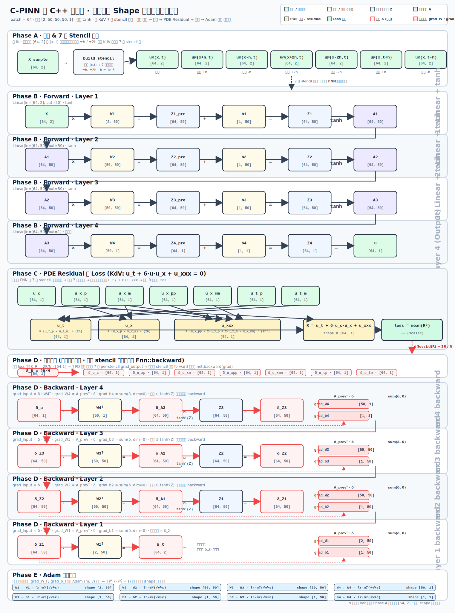
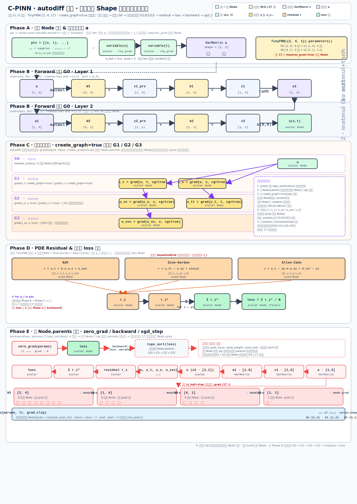

# 计算流图目录

本目录存放项目的 Markdown 版计算流图，使用 Mermaid 绘制，内容严格对应当前仓库中的实际实现。

## 文件说明

- [pure_cpp_pinn_flow.md](./pure_cpp_pinn_flow.md)  
  纯 C++ 主训练链路：输入采样、FNN 层级、有限差分 stencil、PDE residual、反向传播与参数更新。

- [autodiff_matrix_flow.md](./autodiff_matrix_flow.md)  
  `examples/autodiff/matrix_graph.cpp` 中 mini autodiff PINN 原型：`Node` 图、`VarMatrix` 流、`matmul` 层级、PDE 高阶导链路。

- [assets/pinn_overall_shape_flow.svg](./assets/pinn_overall_shape_flow.svg)  
  **数值法路径 · 端到端总流程图（带 shape 的层级数据流）**：采样 → 7 点 stencil 构造 → 共享 FNN 前向（4 层，逐层标注 W/b 与中间特征 shape）→ KdV PDE residual 与 loss → 手工链式法则反向（逐层 grad_W/grad_b）→ Adam 参数更新。
  

- [assets/pinn_autodiff_shape_flow.svg](./assets/pinn_autodiff_shape_flow.svg)  
  **autodiff 原型路径 · 端到端总流程图（带 shape 的层级数据流）**：pts → 叶子 Node 建立（x, t requires_grad=true）→ TinyFNN({2,4,1}) 前向建图 G0（逐层标注 VarMatrix shape）→ `grad(..., create_graph=true)` 嵌套扩展 G1 / G2 / G3（一/二/三阶导图）→ 3 种 PDE（KdV / Sine-Gordon / Allen-Cahn）residual 择一 → mean(r²) loss → 沿 Node.parents 逆拓扑 backward → 17 个叶子参数 `Node.grad` 写回 + `sgd_step` 更新。
  

## 适用范围

- 纯 C++ 主训练路径：对应 `examples/pure_c_kdv.cpp`、`examples/pure_c_sine_gordon.cpp`、`examples/pure_c_allen_cahn.cpp`
- 最小 autodiff 原型：对应 `examples/autodiff/matrix_graph.cpp`

## 说明

- 图中 shape 使用代码中的真实维度。
- 纯 C++ 主训练图默认以 `batch_size=64`、网络结构 `[2, 50, 50, 50, 1]` 为基准。
- autodiff 原型图默认以 `TinyFNN({2, 4, 1})`、单点输入 `(x, t)` 为基准。
