# autodiff 矩阵原型计算流图

本文档对应以下实际代码：

- [matrix_graph.cpp](/Users/hhd/Desktop/test/c-pinn/examples/autodiff/matrix_graph.cpp:1)

这条链路不是主训练路径，而是一个机制验证原型。它的重点是：

- 用 `Node` 表示标量图节点
- 用 `VarMatrix` 组织矩阵形状
- 用 `grad(..., create_graph=true)` 继续构建梯度图
- 在 mini PINN 场景里验证 `u_t / u_x / u_xx / u_xxx / u_tt`

## 1. 全流程数据流向图

这一版先给“参考图风格”的张量块数据流总图，再给程序控制流补充图。核心目标不是只讲步骤，而是把：

- 每一层到底流过哪些 tensor / VarMatrix
- 每个 tensor 的 `shape` 怎么变化
- 块里的每个小圆点如何对应到底层 `Node`
- `loss -> backward -> grad -> sgd_step` 的闭环怎么回到下一轮

都直接画出来。

### 1.1 张量块数据流总图（参考图风格）

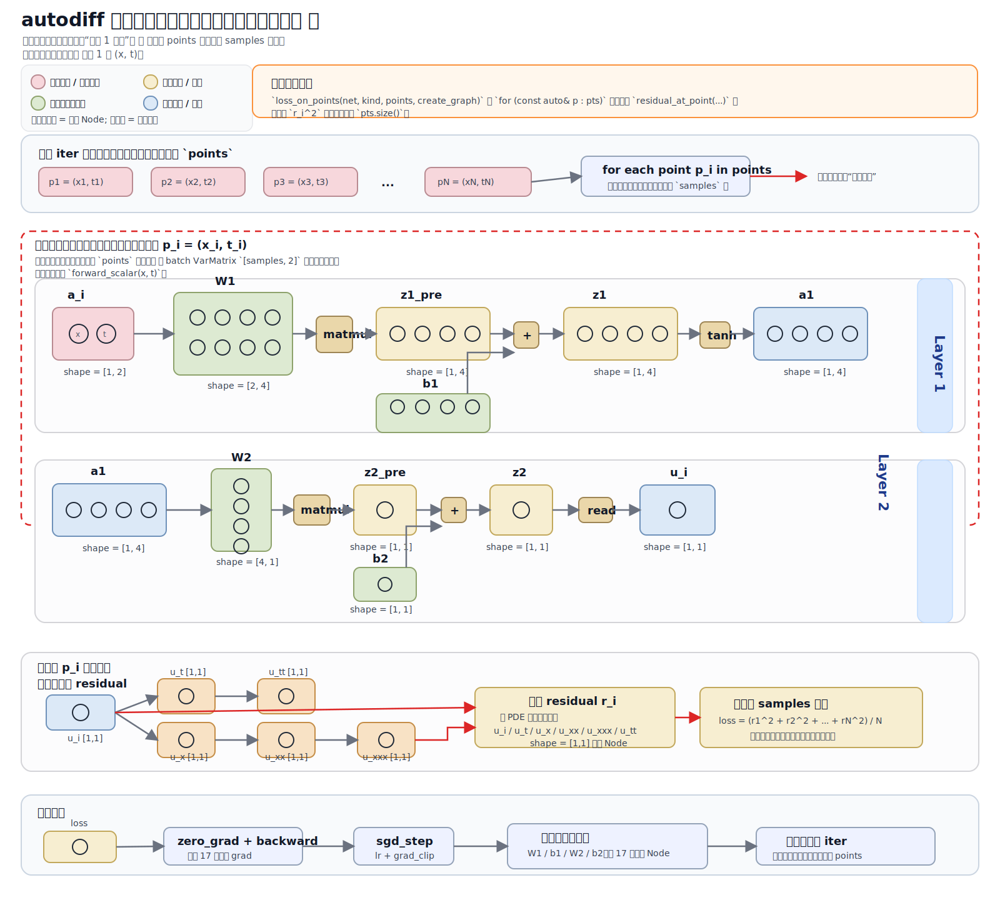

先把一个容易误解的点说死：

- 一轮训练不是“只有 1 个数据点流入”
- 真实代码是一轮 `iter` 使用 `points` 里的全部 `samples` 个点
- 但当前实现也不是 PyTorch 常见的 batch tensor 前向
- 它的真实机制是：
  - `for p_i in points`
  - 每次拿一个点 `(x_i, t_i)` 建一个单点子图 `a_i[1,2] -> ... -> u_i -> r_i`
  - 最后把所有 `r_i^2` 聚合成一个 `loss`

读这张图时，按下面这个约定理解：

- 一个大色块 = 一个 `VarMatrix`，也就是你现在这套原型里的“tensor 视角”
- 色块里的每个小圆点 = 一个底层 `Node`
- 所以它和 PyTorch 的思路已经非常接近了：
  - PyTorch 是一个 tensor 接一个 tensor 地流
  - 你这个原型是一个 `VarMatrix` 接一个 `VarMatrix` 地流
  - 只是当前底层实现还不是张量 kernel，而是“tensor 外形 + scalar Node 图”
- 另外必须补一句：
  - 当前图里如果看到 `a_i [1,2]`，那表示“单点子图的输入 shape”
  - 它不等于“一轮训练只有一个点”
  - 一轮训练实际对应的是上方那条 `points -> for each point -> 聚合 loss` 主线

### 1.2 程序控制流补充图

这里把总流程拆成“左侧前向建图”和“右侧训练闭环”两张并排风格图，方向统一按“从左到右”阅读。要点是：

- 左图只看“单点子图如何建出来”
- 右图只看“loss 如何驱动参数更新，再进入下一轮”
- 但单点子图本身会被 `samples` 个点重复调用
- 两张图合起来，才是 `matrix_graph.cpp` 一次完整迭代的真实数据流

```mermaid
flowchart LR
    subgraph LEFT["前向建图版"]
        direction LR
        PTS["输入点集 pts\nvector<pair<double,double>>\n长度 = samples"] --> LOOP["逐点展开\n每次取 1 个 (x,t)"]
        LOOP --> LEAF["创建叶子 Node\nx.requires_grad = true\nt.requires_grad = true"]
        LEAF --> A0["组装输入矩阵 a\nshape = [1,2]\n[ x  t ]"]
        A0 --> L1["Linear 1\n[1,2] x [2,4] + [1,4]\n-> [1,4]"]
        W1["W1\n[2,4]\n8 个参数 Node"] --> L1
        B1["b1\n[1,4]\n4 个参数 Node"] --> L1
        L1 --> T1["tanh\n[1,4] -> [1,4]"]
        T1 --> L2["Linear 2\n[1,4] x [4,1] + [1,1]\n-> [1,1]"]
        W2["W2\n[4,1]\n4 个参数 Node"] --> L2
        B2["b2\n[1,1]\n1 个参数 Node"] --> L2
        L2 --> U["输出 u(x,t)\nshape = [1,1]\n取 a(0,0)"]
        U --> UT["u_t = grad(u,t,true)"]
        U --> UX["u_x = grad(u,x,true)"]
        UX --> UXX["u_xx = grad(u_x,x,true)"]
        UXX --> UXXX["u_xxx = grad(u_xx,x,true)"]
        UT --> UTT["u_tt = grad(u_t,t,true)"]
        U --> RES["组 residual r\nKdV / SG / AC"]
        UT --> RES
        UX --> RES
        UXX --> RES
        UXXX --> RES
        UTT --> RES
        RES --> RSQ["逐点得到 r^2"]
        RSQ --> LOSS["跨样本求 mean(r^2)\n得到 loss"]
    end

    subgraph RIGHT["训练闭环版"]
        direction LR
        PARAMS["参数池\nW1[2,4] + b1[1,4]\nW2[4,1] + b2[1,1]\n共 17 个叶子 Node"] --> ZG["zero_grad(params)\ngrad 清零"]
        LOSS2["loss\n标量 Node"] --> BW["backward(loss, params)\n逆拓扑回传"]
        ZG --> BW
        BW --> GRADBUF["参数 grad 缓冲\n写入 Node.grad"]
        GRADBUF --> STEP["sgd_step(params, lr, grad_clip)\n更新参数 value"]
        STEP --> NEXT["进入下一轮 iter\n重新取 pts 建图"]
    end

    LOSS -. "把本轮 loss 交给训练闭环" .-> LOSS2

    classDef input fill:#fde2e4,stroke:#c66,color:#111;
    classDef linear fill:#e8f5e9,stroke:#3f7d20,color:#111;
    classDef deriv fill:#dbeafe,stroke:#4a6fa5,color:#111;
    classDef loss fill:#fff3cd,stroke:#b8860b,color:#111;
    classDef train fill:#f3e8ff,stroke:#7c3aed,color:#111;

    class PTS,LOOP,LEAF,A0 input;
    class W1,B1,L1,T1,W2,B2,L2,U linear;
    class UT,UX,UXX,UXXX,UTT deriv;
    class RES,RSQ,LOSS,LOSS2 loss;
    class PARAMS,ZG,BW,GRADBUF,STEP,NEXT train;
```

如果只抓主干，可以把它拆成两句来看：

- 前向建图版：`pts -> (x,t) -> a[1,2] -> Linear[2,4] -> tanh -> Linear[4,1] -> u -> 各阶导数 -> residual -> loss`
- 训练闭环版：`loss -> backward -> 参数 grad -> sgd_step -> 下一轮重新建图`

## 2. 建图主流程图

这份原型里，“建图”才是主流程。训练只是围绕这张图做 loss 聚合和参数更新。

```mermaid
flowchart LR
    P["输入采样点\n(x, t)\n每次是一个标量对"] --> N0["创建叶子 Node\nx.requires_grad=true\nt.requires_grad=true"]
    N0 --> F0["前向建图 G0\nTinyFNN.forward_scalar(x, t)\n得到 u(x,t)"]
    F0 --> D1["一阶导建图\nu_t = grad(u,t,true)\nu_x = grad(u,x,true)"]
    D1 --> D2["二阶/三阶导继续建图\nu_xx = grad(u_x,x,true)\nu_xxx = grad(u_xx,x,true)\nu_tt = grad(u_t,t,true)"]
    D2 --> R["按 PDE 组 residual\nKdV / Sine-Gordon / Allen-Cahn"]
    R --> L["对采样点集求 mean(r^2)\n得到 loss Node"]
    L --> B["backward(loss, params)\n把梯度写入 17 个叶子参数 Node.grad"]
    B --> U["sgd_step(params)\n更新 W1 / b1 / W2 / b2"]

    classDef input fill:#fde2e4,stroke:#c66,color:#111;
    classDef build fill:#dbeafe,stroke:#4a6fa5,color:#111;
    classDef eq fill:#fff3cd,stroke:#b8860b,color:#111;
    classDef train fill:#e8f5e9,stroke:#3f7d20,color:#111;

    class P,N0 input;
    class F0,D1,D2 build;
    class R,L eq;
    class B,U train;
```

## 3. Node 与 VarMatrix 结构

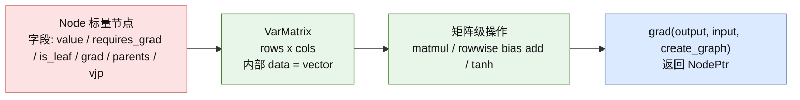

## 4. TinyFNN 前向层级与 shape

对应 [TinyFNN](/Users/hhd/Desktop/test/c-pinn/examples/autodiff/matrix_graph.cpp:362)。

- 网络结构：`{2, 4, 1}`
- 输入是单点 `(x, t)`，不是 batch
- 所以矩阵 shape 是：
  - 输入 `a: [1, 2]`
  - 第一层输出 `z1: [1, 4]`
  - 激活后 `a1: [1, 4]`
  - 第二层输出 `z2: [1, 1]`

```mermaid
flowchart LR
    XT["输入 Node\nx: 标量\nt: 标量"] --> A0["组装输入矩阵 a\nshape = [1, 2]"]
    A0 --> MM1["matmul(a, W1)\n[1, 2] x [2, 4] -> [1, 4]"]
    MM1 --> B1["rowwise bias add\n+[1, 4] -> [1, 4]"]
    B1 --> T1["tanh\n[1, 4] -> [1, 4]"]
    T1 --> MM2["matmul(a1, W2)\n[1, 4] x [4, 1] -> [1, 1]"]
    MM2 --> B2["rowwise bias add\n+[1, 1] -> [1, 1]"]
    B2 --> U["输出 u(x,t)\nshape = [1, 1]\n最终取 a(0,0) 作为 Node"]

    classDef input fill:#fde2e4,stroke:#c66,color:#111;
    classDef linear fill:#e8f5e9,stroke:#3f7d20,color:#111;
    classDef act fill:#fff3cd,stroke:#b8860b,color:#111;
    classDef output fill:#dbeafe,stroke:#4a6fa5,color:#111;

    class XT,A0 input;
    class MM1,B1,MM2,B2 linear;
    class T1 act;
    class U output;
```

### 4.1 线性层权重矩阵小块示意

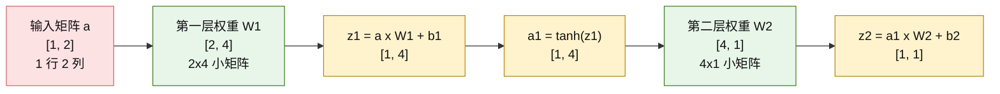

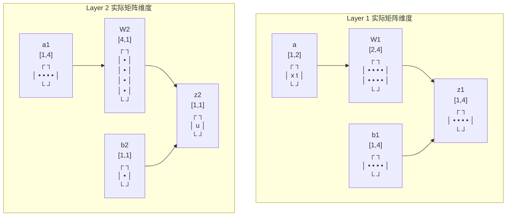

## 5. autodiff PDE 导数链路

对应 [residual_at_point](/Users/hhd/Desktop/test/c-pinn/examples/autodiff/matrix_graph.cpp:444)。

所有导数结果本质上都是 `NodePtr` 标量，不是批量 Tensor。

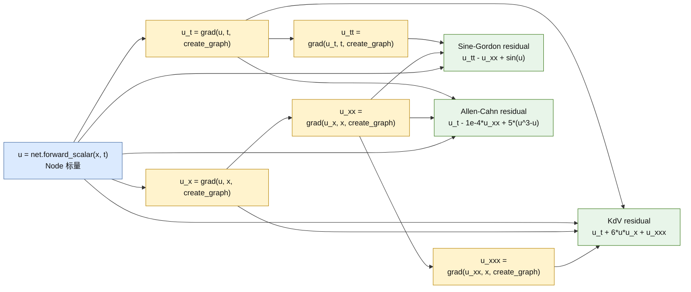

### 5.1 建图视角下的导数图扩展

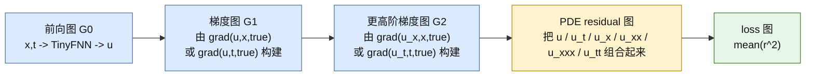

## 6. 多样本 loss 聚合

对应 [loss_on_points](/Users/hhd/Desktop/test/c-pinn/examples/autodiff/matrix_graph.cpp:473)。

- 输入点集：`pts = vector<pair<double,double>>`
- 每个点生成一个 residual 标量 `r`
- 总 loss 是 `mean(r^2)`

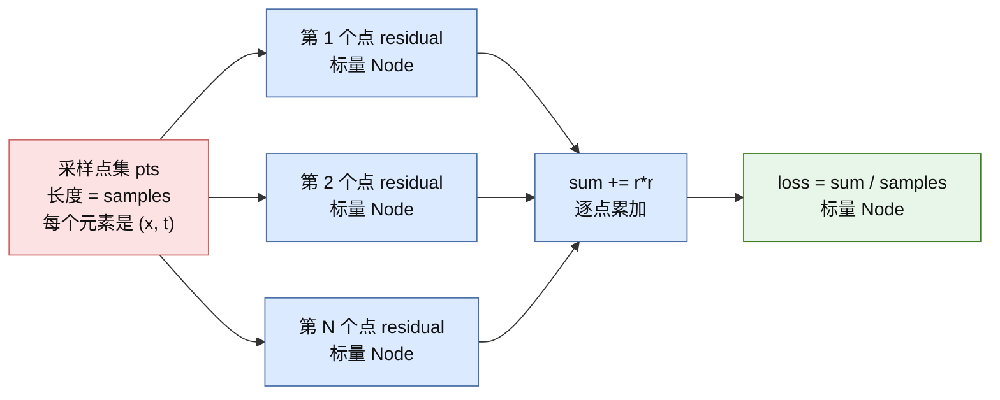

## 7. 参数更新闭环

对应 [zero_grad](/Users/hhd/Desktop/test/c-pinn/examples/autodiff/matrix_graph.cpp:254)、[backward](/Users/hhd/Desktop/test/c-pinn/examples/autodiff/matrix_graph.cpp:262)、[sgd_step](/Users/hhd/Desktop/test/c-pinn/examples/autodiff/matrix_graph.cpp:275)。

参数本质上都是叶子 `Node`：

- 第一层权重：`W1 [2, 4]`，8 个叶子节点
- 第一层偏置：`b1 [1, 4]`，4 个叶子节点
- 第二层权重：`W2 [4, 1]`，4 个叶子节点
- 第二层偏置：`b2 [1, 1]`，1 个叶子节点
- 总参数数：`17`

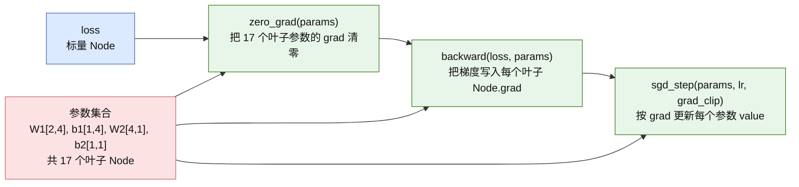

## 8. 反向传播梯度流专用图

这里的反向传播不是 PyTorch 那种张量级 kernel，而是：

- `loss` 先通过 `backward_collect` 沿 `Node.parents` 逆拓扑传播
- 得到每个叶子参数节点的梯度
- 再把这些梯度写入 `Node.grad`

### 8.1 参考图风格的梯度回流图

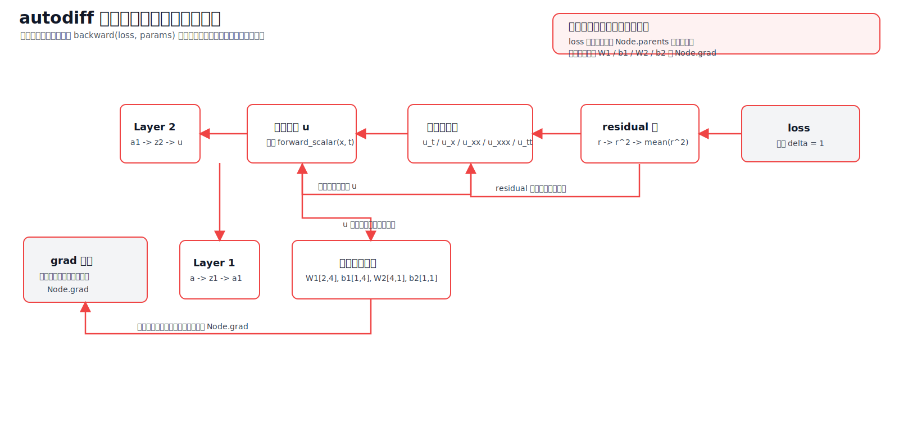

这张图要点很直接：

- 回流方向是 `loss -> residual 图 -> 导数节点 -> u -> Layer 2 -> Layer 1 -> 参数叶子`
- 当前原型训练时，真正长期落盘的是参数叶子的 `Node.grad`
- 中间节点会参与回传，但不会像完整框架那样都长期保留 `.grad`

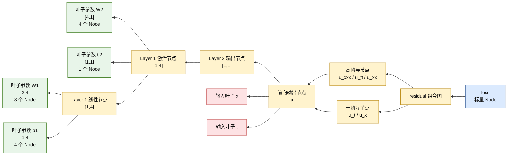

### 8.2 中文说明

- `backward(loss, params)` 只把叶子参数节点的梯度写回 `Node.grad`，不会像完整框架那样为所有中间节点长期保留 `.grad`。
- 这张图强调的是“梯度沿图往回收集到 W1 / b1 / W2 / b2”，这才是当前原型训练闭环的关键。

## 9. 与纯 C++ 主训练路径的区别

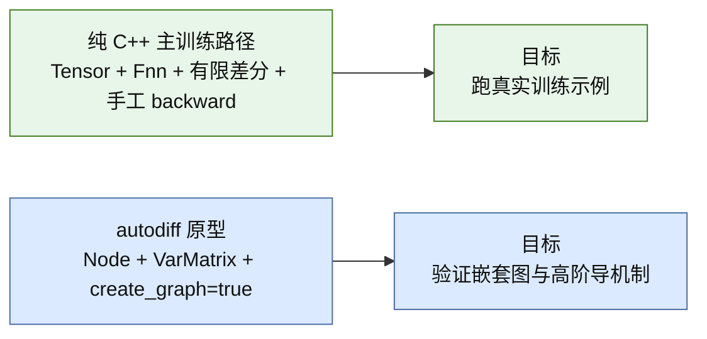

## 10. 一句话总结

- 这个原型的“矩阵”只是组织形式，底层仍然是标量 `Node` 图。
- 它最重要的价值不是速度，而是把“**先建前向图，再建导数图，再建 residual/loss 图，最后沿 Node 图反传到参数**”这条链条明确跑通。
