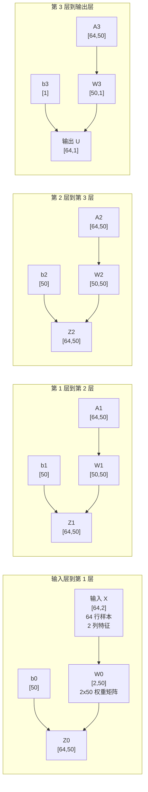
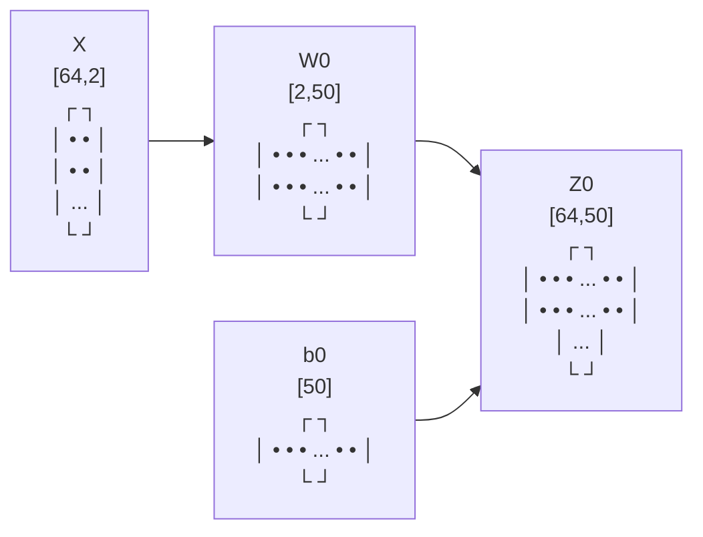
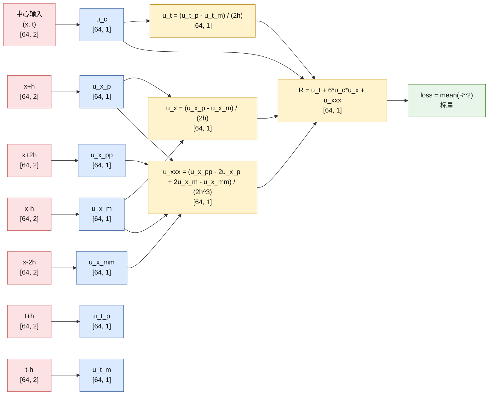
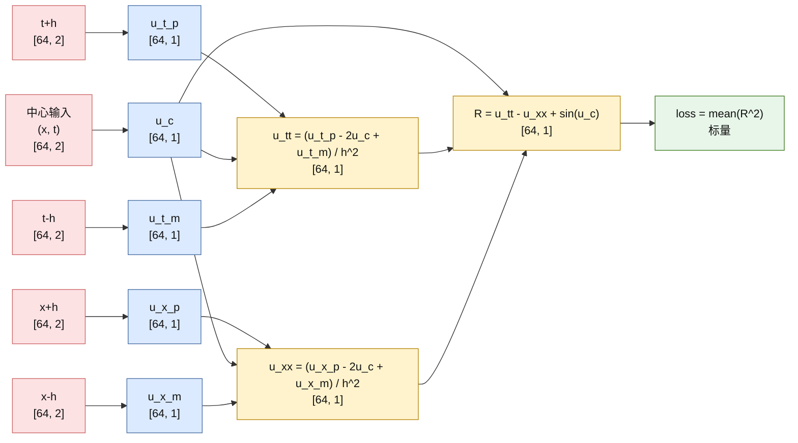
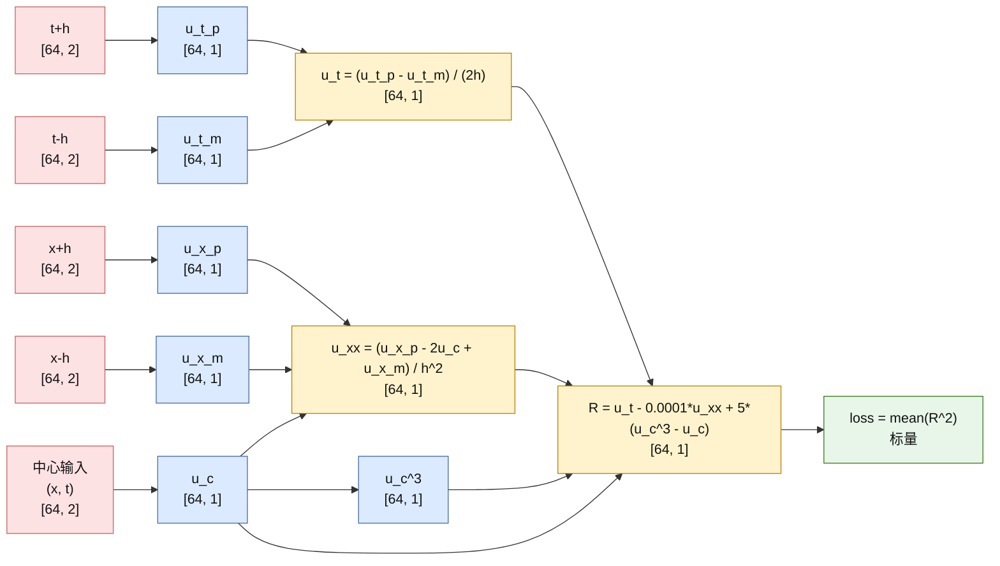

# 纯 C++ PINN 主训练计算流图

本文档对应以下实际代码：

- [pure_c_kdv.cpp](/Users/hhd/Desktop/test/c-pinn/examples/pure_c_kdv.cpp:1)
- [pure_c_sine_gordon.cpp](/Users/hhd/Desktop/test/c-pinn/examples/pure_c_sine_gordon.cpp:1)
- [pure_c_allen_cahn.cpp](/Users/hhd/Desktop/test/c-pinn/examples/pure_c_allen_cahn.cpp:1)
- [fnn.cpp](/Users/hhd/Desktop/test/c-pinn/src/nn/fnn.cpp:81)
- [fnn.hpp](/Users/hhd/Desktop/test/c-pinn/include/pinn/nn/fnn.hpp:69)

## 1. 主网络前向层级

当前纯 C++ 主训练路径的网络结构在三个 PDE 示例里一致：

- 输入维度：`2`，表示 `(x, t)`
- 隐层结构：`50 -> 50 -> 50`
- 输出维度：`1`，表示标量场 `u(x, t)`
- 激活函数：隐藏层为 `tanh`，输出层无激活
- 默认 batch：`64`

```mermaid
flowchart LR
    X["输入采样张量 x_t\nshape = [64, 2]\n列0=x, 列1=t"] --> L1["Linear 1\n输入 [64, 2]\nweight_t [2, 50]\nbias [50]\n输出 [64, 50]"]
    L1 --> A1["Tanh 1\n输入 [64, 50]\n输出 [64, 50]"]
    A1 --> L2["Linear 2\n输入 [64, 50]\nweight_t [50, 50]\nbias [50]\n输出 [64, 50]"]
    L2 --> A2["Tanh 2\n输入 [64, 50]\n输出 [64, 50]"]
    A2 --> L3["Linear 3\n输入 [64, 50]\nweight_t [50, 50]\nbias [50]\n输出 [64, 50]"]
    L3 --> A3["Tanh 3\n输入 [64, 50]\n输出 [64, 50]"]
    A3 --> L4["Linear 4\n输入 [64, 50]\nweight_t [50, 1]\nbias [1]\n输出 [64, 1]"]
    L4 --> U["网络输出 u(x,t)\nshape = [64, 1]"]

    classDef input fill:#f8d7da,stroke:#b85c6b,color:#111;
    classDef linear fill:#e8f5e9,stroke:#4b8b3b,color:#111;
    classDef act fill:#fff3cd,stroke:#c49a00,color:#111;
    classDef output fill:#dbeafe,stroke:#4a6fa5,color:#111;

    class X input;
    class L1,L2,L3,L4 linear;
    class A1,A2,A3 act;
    class U output;
```

### 1.1 每层权重矩阵小块示意

这部分不是抽象图，而是直接对应 `Linear::forward` 里的真实矩阵乘法 shape：

## 2. 训练主循环总览

这条流对应三个纯 C++ PDE 示例的共同骨架。关键特点是：

- 先采样 `x_t: [64, 2]`
- 再构造 stencil 点
- 所有 stencil 点都经过同一个 `Fnn`
- 由多个 `u(...)` 组合 PDE residual
- 对每个 stencil 点分别重新前向并调用 `net.backward(...)`
- 最后由 Adam 更新参数

```mermaid
flowchart LR
    S1["1. 随机采样输入\nx_t shape = [64, 2]"] --> S2["2. 构造 stencil 输入集合\n每个点 shape = [64, 2]"]
    S2 --> S3["3. forward_all(net, stencils)\n每个 stencil 输出 shape = [64, 1]"]
    S3 --> S4["4. 按 PDE 公式计算导数近似\nu_t / u_x / u_xx / u_xxx / u_tt\nshape 均为 [64, 1]"]
    S4 --> S5["5. 计算 residual R\nshape = [64, 1]"]
    S5 --> S6["6. loss = mean(R^2)\nshape = 标量"]
    S6 --> S7["7. 计算 dL/dR\nshape = [64, 1]"]
    S7 --> S8["8. 拆成每个 stencil 点的梯度权重\n每个 grad shape = [64, 1]"]
    S8 --> S9["9. 对每个 stencil 点:\nnet.forward(input)\nnet.backward(grad)"]
    S9 --> S10["10. AdamOptimizer.step()\n更新所有 Linear 层参数"]

    classDef step fill:#f5f5f5,stroke:#666,color:#111;
    class S1,S2,S3,S4,S5,S6,S7,S8,S9,S10 step;
```

## 3. KdV 方程计算流

对应 [pure_c_kdv.cpp](/Users/hhd/Desktop/test/c-pinn/examples/pure_c_kdv.cpp:27)。

### 3.1 Stencil 点与 shape

- 中心点：`(x, t)`，`[64, 2]`
- 空间偏移：`x+h`、`x-h`、`x+2h`、`x-2h`，各自 `[64, 2]`
- 时间偏移：`t+h`、`t-h`，各自 `[64, 2]`
- 共 `7` 个 stencil 点

### 3.2 中文说明

- `forward_all` 会让 7 个 stencil 输入都经过同一个 `Fnn`，所以每个点的输出 shape 都是 `[64, 1]`。
- KdV 的导数近似里同时使用了一阶时间导、一次空间导和三阶空间导，因此 stencil 点数最多。
- 反向阶段不会直接对 PDE 公式自动求导，而是先手工算出每个 stencil 输出对应的梯度权重，再分别调用 `net.backward(...)`。

## 4. Sine-Gordon 方程计算流

对应 [pure_c_sine_gordon.cpp](/Users/hhd/Desktop/test/c-pinn/examples/pure_c_sine_gordon.cpp:27)。

### 4.1 Stencil 点与 shape

- 中心点：`(x, t)`，`[64, 2]`
- 空间偏移：`x+h`、`x-h`，各自 `[64, 2]`
- 时间偏移：`t+h`、`t-h`，各自 `[64, 2]`
- 共 `5` 个 stencil 点

### 4.2 中文说明

- Sine-Gordon 只需要二阶时间导和二阶空间导，所以 stencil 数量从 KdV 的 `7` 个减少到 `5` 个。
- `dR/du_c` 里包含 `cos(u_c)`，这一项在代码里是手工构造的 `Tensor`，不是自动微分得到的。

## 5. Allen-Cahn 方程计算流

对应 [pure_c_allen_cahn.cpp](/Users/hhd/Desktop/test/c-pinn/examples/pure_c_allen_cahn.cpp:27)。

### 5.1 Stencil 点与 shape

- 中心点：`(x, t)`，`[64, 2]`
- 空间偏移：`x+h`、`x-h`，各自 `[64, 2]`
- 时间偏移：`t+h`、`t-h`，各自 `[64, 2]`
- 共 `5` 个 stencil 点

### 5.2 中文说明

- Allen-Cahn 和 Sine-Gordon 一样都是 `5` 点 stencil，但 residual 里多了非线性反应项 `5(u^3-u)`。
- 这意味着中心点 `u_c` 的梯度不仅来自有限差分项，还来自 `15u_c^2 - 5` 这一反应项导数。

## 6. 反向传播与参数 shape

对应 [Linear::backward](/Users/hhd/Desktop/test/c-pinn/src/nn/fnn.cpp:109) 和 [Fnn::backward](/Users/hhd/Desktop/test/c-pinn/src/nn/fnn.cpp:211)。

```mermaid
flowchart LR
    G4["输出梯度 grad_output\n[64, 1]"] --> B4["Layer 4 backward\ngrad_weight [50, 1]\ngrad_bias [1]\ngrad_input [64, 50]"]
    B4 --> BA3["Tanh 3 导数相乘\n[64, 50]"]
    BA3 --> B3["Layer 3 backward\ngrad_weight [50, 50]\ngrad_bias [50]\ngrad_input [64, 50]"]
    B3 --> BA2["Tanh 2 导数相乘\n[64, 50]"]
    BA2 --> B2["Layer 2 backward\ngrad_weight [50, 50]\ngrad_bias [50]\ngrad_input [64, 50]"]
    B2 --> BA1["Tanh 1 导数相乘\n[64, 50]"]
    BA1 --> B1["Layer 1 backward\ngrad_weight [2, 50]\ngrad_bias [50]\ngrad_input [64, 2]"]

    classDef grad fill:#dbeafe,stroke:#4a6fa5,color:#111;
    classDef linear fill:#e8f5e9,stroke:#3f7d20,color:#111;
    classDef act fill:#fff3cd,stroke:#b8860b,color:#111;

    class G4 grad;
    class B1,B2,B3,B4 linear;
    class BA1,BA2,BA3 act;
```

### 6.1 反向传播梯度流专用图

```mermaid
flowchart RL
    R["residual loss\n标量"] --> GO["dL/dU\n[64,1]"]
    GO --> L4["输出层 Linear.backward\nW3:[50,1]\nb3:[1]\n得到 grad_input [64,50]"]
    L4 --> A3["Tanh 3 导数相乘\n[64,50]"]
    A3 --> L3["Layer 3 Linear.backward\nW2:[50,50]\nb2:[50]"]
    L3 --> A2["Tanh 2 导数相乘\n[64,50]"]
    A2 --> L2["Layer 2 Linear.backward\nW1:[50,50]\nb1:[50]"]
    L2 --> A1["Tanh 1 导数相乘\n[64,50]"]
    A1 --> L1["Layer 1 Linear.backward\nW0:[2,50]\nb0:[50]\n得到 grad_input [64,2]"]

    classDef loss fill:#dbeafe,stroke:#4a6fa5,color:#111;
    classDef linear fill:#e8f5e9,stroke:#3f7d20,color:#111;
    classDef act fill:#fff3cd,stroke:#b8860b,color:#111;

    class R,GO loss;
    class L1,L2,L3,L4 linear;
    class A1,A2,A3 act;
```

### 6.2 中文说明

- `Linear::backward` 里每层都会产生三类量：`grad_input`、`grad_weight`、`grad_bias`。
- `Fnn::backward` 的主干顺序是：输出层梯度进入最后一层，然后逐层穿过激活函数导数，再进入前一层线性层。
- 这一套流和 autodiff 原型不同，它不是沿 `Node.parents` 回传，而是沿 `Fnn` 的层缓存和 `Tensor` 矩阵乘法规则回传。

## 7. 一句话总结

- 纯 C++ 主训练路径不是 autograd 图，而是“**有限差分算 PDE 导数 + 手工链式法则驱动 `Fnn::backward`**”。
- 真正穿过网络的张量 shape 始终清晰稳定：输入 `[64, 2]`，隐藏层 `[64, 50]`，输出 `[64, 1]`。
- PDE 差异主要体现在 stencil 点数和 residual 组合方式，而不是网络层 shape 本身。
